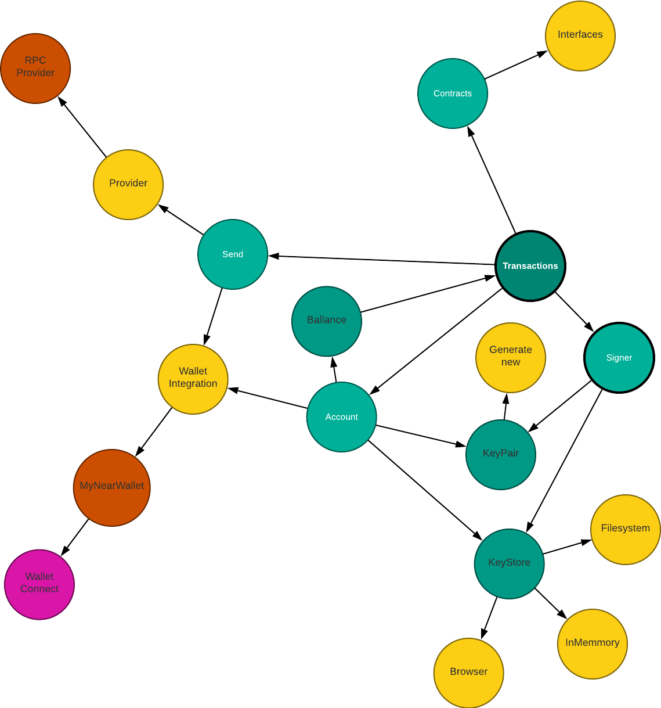

# Near.js architecture v0.1

Near.js is a modular typescript developer tool which provides everything you need to build your Web2 application that interacts with the Near and any ways.

This tool can be used for any usecases:

1. Building CLI tools
2. Building backend applications and APIs
3. Building web UI application

## Library mind map

The vision of MagicPowered team is that any application built around web3 apps or blockchain in general essentially doing two major things:

1. Query and send transactions
2. Manage accounts



The diagram above shows an abstract mind map of the library. As you can see the library is structured around two main pieces:

- Transaction
- Account

Everything around this two circles considered complimentary to the one of these points.

## Library structure

```
.
├── LICENSE
├── README.md
├── doc
├── packages
│   ├── config
│   ├── keys
│   ├── keystore
│   ├── provider-core
│   ├── provider-rpc
│   ├── provider-wallet-core
│   ├── provider-wallet-my-near-wallet
│   ├── provider-wallet-sender
│   ├── sandbox
│   ├── tx
│   └── units
├── package.json
├── pnpm-workspace.yaml
├── tsconfig.package.json
└── tsconfig.project.json
```

The library is a multi package repo. Each package represents its own responsibility and functionality developer may need building their application.
The list of packages can be found [here](./packages.md)
