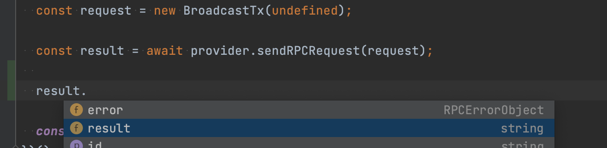
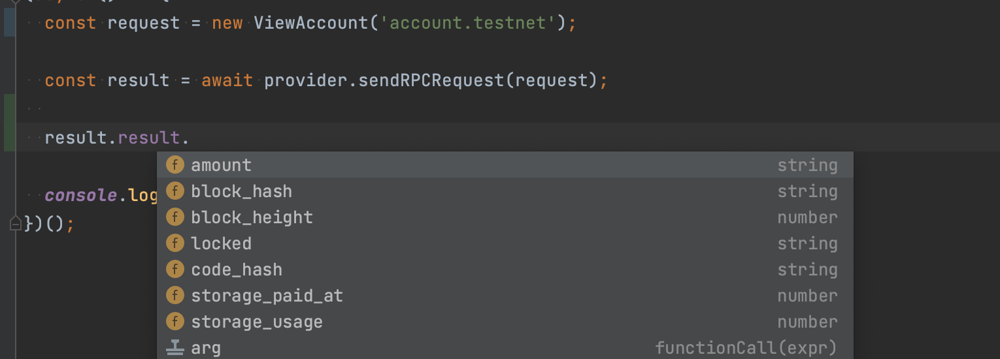

# @nearjs/provider-core

Core RPC provider is a client library for Near Blockchain RPC API.
With this library you can query RPC, send View calls and transactions, and operate with connected accounts.

## Installation

```shell
npm i @nearjs/provider-core --save
```

## Usage

### Configuration

```typescript
import { KeyStore } from '@nearjs/account';

type RPCProviderHeadersConfig = { [key: string]: string | number };

enum Network {
  TESTNET = 'testnet',
  MAINNET = 'mainnet',
  BETANET = 'betanet',
  LOCALNET = 'localnet',
  CUSTOM = 'custom',
}

interface RPCProviderConfig {
  rpcUrl: string; // url of Near RCP API
  networkId: Network; // network id: testnet, betanet, mainnet, custom
  allowInsecure?: boolean; // not recomended: allow insecure connection to RPC API 
  timeout?: number; // timeout for RPC requests (default: 30s)
  headers?: RPCProviderHeadersConfig; // headers that should be injected to every RPC call
  keyStore?: KeyStore; // Container for user key pairs and access keys
}
```

Since RPCProviderConfig is just an interface you may construct plain object with this fields and just put it to the provider constructor.

```typescript
import { NearRPCProvider, Network } from '@nearjs/provider-core';

const provider = new NearRPCProvider({
  rpcUrl: 'https://rpc.testnet.near.org',
  networkId: Network.TESTNET
});
```

If you are using default Near networks (localnet, testnet, betanet or mainnet) with default RPC API URLs you may use one of predefined configuration constructors:

```typescript
import { mainnetRPCConfig, betanetRPCConfig, testnetRPCConfig, localnetRPCConfig, NearRPCProvider } from '@nearjs/provider-core';

const mainnetProvider = new NearRPCProvider(mainnetRPCConfig());
const betanetProvider = new NearRPCProvider(betanetRPCConfig());
const testnetProvider = new NearRPCProvider(testnetRPCConfig());
const localnetProvider = new NearRPCProvider(localnetRPCConfig());
```

#### Configuring key stores

Configuration of KeyStore is optional for Near RPC Provider since all query and view calls does not require any access keys.
However, to send transactions you have to sign them using wallet access keys. In order to manage user keys NearJS provides several options to store user's keys:

- [@nearjs/account](./account.md) - InMemoryKeyStore - stores access keys in RAM
- [@nearjs/browser-key-store](./browser-key-store.md) - BrowserKeyStore - store access keys in browser local or session storage
- [@nearjs/fs-key-store](./fs-key-store.md) - FileSystemKeyStore - store access keys in file system

To enable sending transactions using NearRPCProvider you have to set one of KeyStores implementation to the provider configuration, otherwise all transactions sending will throw an error

```typescript
import { NearRPCProvider, testnetRPCConfig } from '@nearjs/provider-core';
import { FileSystemKeyStore } from '@nearjs/fs-key-store';

(async () => {
  // Instantiate FileSystem KeyStore implementation
  const keyStore = new FileSystemKeyStore();
  
  // use keyStore with testnet configuration
  const config = testnetRPCConfig(keyStore);

  // provide complete configuration to the provider constructor
  const provider = new NearRPCProvider(config);

  // Define actions to execcute. In this case we send 20 toxa tokens to toxa02.testnet address
  const actions = [
    new FunctionCall(
      'ft_transfer',
      {
        receiver_id: 'toxa02.testnet',
        amount: '200000000000000000000'
      },
      1,
      1
    )
  ];

  // send transaction successfull 
  const result = await provider.sendTransactionSync('toxa.testnet', 'toxa.tokens.testnet', actions);
})();
```

```typescript
import { NearRPCProvider, testnetRPCConfig, ViewAccount } from '@nearjs/provider-core';
import { FileSystemKeyStore } from '@nearjs/fs-key-store';

(async () => {
  // construct testnet configuration without key store
  const config = testnetRPCConfig();

  // provide complete configuration to the provider constructor
  const provider = new NearRPCProvider(config);
  
  // error will be thrown since there is not available key store, so we cannot sign transaction before send
  try {
    const actions = [
      new FunctionCall(
        'ft_transfer',
        {
          receiver_id: 'toxa02.testnet',
          amount: '200000000000000000000'
        },
        1,
        1
      )
    ];
    const result = await provider.sendTransactionSync('toxa.testnet', 'toxa.tokens.testnet', actions);
  } catch (e) { 
    console.error(e)
  }

  // success call since there is no signature required to send view calls
  const result = await provider.sendViewCall('nft.token.testnet', 'nft_tokens_for_owner', {account_id: 'some-user.testnet'});

  // success call since ViewAccount is a query call to RPC node, so no signature required to send this call
  const viewAccountRequest = new ViewAccount('some-user.testnet');
  const userAccountInfo = await provider.sendRPCRequest(viewAccountRequest); 
})();
```

### Operating with connected accounts

NearRPCProvider provides a set of functions that helps you control list of connected accounts and their access keys:

```typescript
import { NearRPCProvider, testnetRPCConfig } from '@nearjs/provider-core';
import { FileSystemKeyStore } from '@nearjs/fs-key-store';

(async () => {
  // Define that our keys are stored in file system
  const keyStore = FileSystemKeyStore();
  // Construct provider configuration
  const config = testnetRPCConfig(keyStore);
  // Construct RPC Provider
  const provider = new NearRPCProvider(config);
  
  // returns public key for provided user. Return null if no key found
  const publicKey = await provider.getPublicKey('my.account.testnet');
  
  // returns list of connected accounts
  const accountsConnected = await provider.listConnectedAccounts();
  
  // defines if provided account is connected to this provider (can sign on behalf of provided user)
  const isAccountConnected = await provider.isAccountConnected('my.account.testnet');
})();
```

### Sign and verify messages with user keys

Provide can sign random messages with user's keys and verify signatures with provided public key

#### Sign messages

```typescript
import { NearRPCProvider, testnetRPCConfig } from '@nearjs/provider-core';
import { FileSystemKeyStore } from '@nearjs/fs-key-store';

(async () => {
  // Define that our keys are stored in file system
  const keyStore = FileSystemKeyStore();
  // Construct provider configuration
  const config = testnetRPCConfig(keyStore);
  // Construct RPC Provider
  const provider = new NearRPCProvider(config);
  
  const messageToSign = 'some message';
  // convert string message to bytes to sign them
  const messageBytes = Uint8Array.from(messageToSign.split('').map(letter => letter.charCodeAt(0)));
  
  // sign message bytes with key that correspond to provided user
  const signature = await provider.sign('my.account.testnet', messageBytes);
})();
```

#### Verify signatures

```typescript
import { NearRPCProvider, testnetRPCConfig } from '@nearjs/provider-core';
import { FileSystemKeyStore } from '@nearjs/fs-key-store';

const message = new Uint8Array();
const signature = new Uint8Array();
const publicKey = new Uint8Array();

(async (message: Uint8Array, signature: Uint8Array, publicKey: Uint8Array) => {
  // Define that our keys are stored in file system
  const keyStore = FileSystemKeyStore();
  // Construct provider configurations
  const config = testnetRPCConfig(keyStore);
  // Construct RPC Provider
  const provider = new NearRPCProvider(config);
  
  // pass message, 
  const isSignatureValid = await provider.verify(message, signature, publicKey);
})(message, signature, publicKey);
```

### Sending transactions

As was mentioned above user's keys required to send any transaction, since sending transactions requires user signature.
Before sending transaction you should build necessary actions that should be executed in your transaction using [@nearjs/tx](./tx.md) module:

```typescript
import { FunctionCall } from '@nearjs/tx';

const action =
  new FunctionCall(
    'ft_transfer', // method name
    { // arguments
      receiver_id: 'toxa02.testnet',
      amount: '200000000000000000000'
    },
    1, // gas limit
    1 // attached Near deposit
  );
```

Learn more about action types and their constructors [here](./tx.md)

Complete example:

```typescript
import { NearRPCProvider, testnetRPCConfig } from '@nearjs/provider-core';
import { FileSystemKeyStore } from '@nearjs/fs-key-store';

(async () => {
  // Instantiate FileSystem KeyStore implementation
  const keyStore = new FileSystemKeyStore();
  
  // use keyStore with testnet configuration
  const config = testnetRPCConfig(keyStore);

  // provide complete configuration to the provider constructor
  const provider = new NearRPCProvider(config);

  // Define actions to execcute. In this case we send 20 toxa tokens to toxa02.testnet address
  const action =
    new FunctionCall(
      'ft_transfer',
      {
        receiver_id: 'toxa02.testnet',
        amount: '200000000000000000000'
      },
      1, // gas limit
      1 // attached Near deposit
    );
  
  // send transaction successfull 
  const result = await provider.sendTransactionSync('toxa.testnet', 'toxa.tokens.testnet', [action]);
})();
```

### Sending RPC queries

You can send RPC queries to the RPC API by using `sendRPCRequest` method:

```typescript
import { NearRPCProvider, testnetRPCConfig, ViewAccessKey, ViewAccount } from '@nearjs/provider-core';
import { FileSystemKeyStore } from '@nearjs/fs-key-store';

(async () => {
  // Instantiate FileSystem KeyStore implementation
  const keyStore = new FileSystemKeyStore();

  // use keyStore with testnet configuration
  const config = testnetRPCConfig(keyStore);

  // provide complete configuration to the provider constructor
  const provider = new NearRPCProvider(config);

  // Build ViewAccount query
  const viewAccount = new ViewAccount('my.account.testnet');
  // send query 
  const account = await provider.sendRPCRequest(viewAccount);
})();
```

You can query account state, account keys, block height and any other queries supported by Near RPC provider. 

### Sending view requests to your contracts

To send view call you can use one of: 
- `sendRPCRequest` - low level API for RPC query calls
- `sendViewCall` - special API for view calls

```typescript
import { NearRPCProvider, testnetRPCConfig, ViewAccessKey, ViewAccount } from '@nearjs/provider-core';
import { FileSystemKeyStore } from '@nearjs/fs-key-store';

(async () => {
  // Instantiate FileSystem KeyStore implementation
  const keyStore = new FileSystemKeyStore();

  // use keyStore with testnet configuration
  const config = testnetRPCConfig(keyStore);

  // provide complete configuration to the provider constructor
  const provider = new NearRPCProvider(config);
  
  // send view call to see amount of tokens of user 
  const amountOfTokens = await provider.sendViewCall('toxa.tokens.testnet', 'ft_balance_of', { account_id: 'toxa.testnet' });
})();
```

## Dynamic annotations

The provider class support dynamic type annotations meaning that return type of RPC request is defined on the flight by the `sendRPCRequest` input argument:

For example, if you send BroadcastTX request, the result field will be typed as string



If you send ViewAccount request, the result field will be typed as a ViewAccountResult object



Dynamic signature supported by majority of javascript IDE, if you have any troubles with it don't hesitate to open new issue on our GitHub :) 
